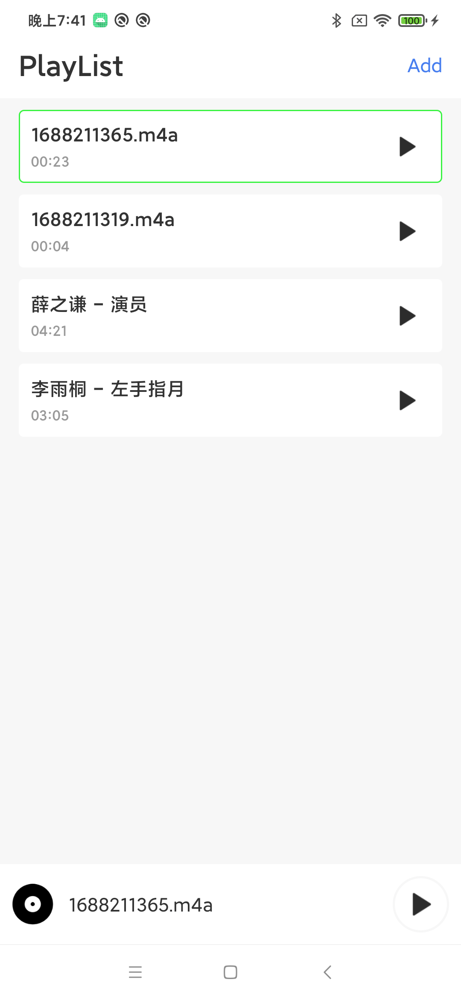
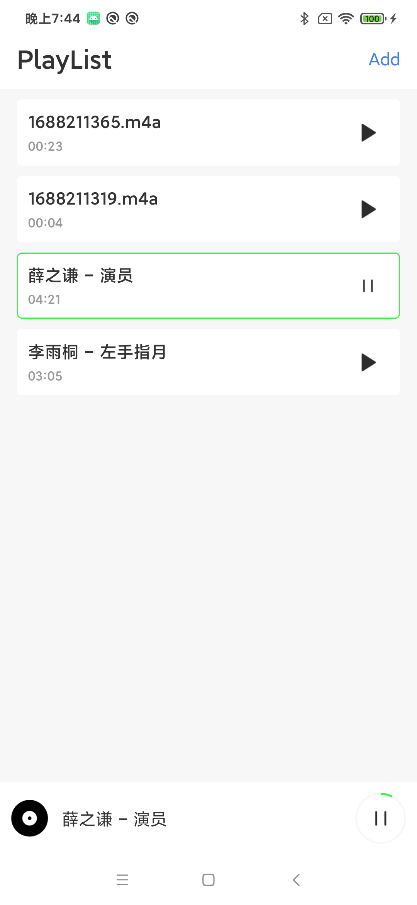
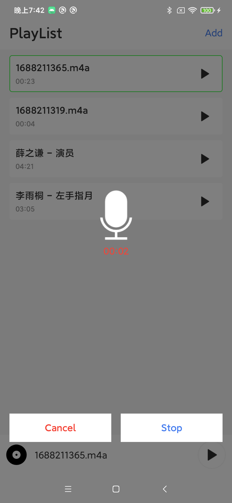
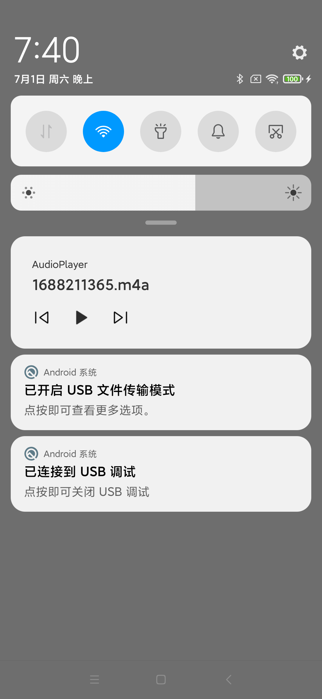

## Android-Audio-Player

一个简单的Android音频播放器项目，麻雀虽小五脏俱全，可以以此为参考实现自己项目中的音频播放器。

[下载地址](https://github.com/zrheasy/Android-Audio-Player/releases/download/v1.0.0/audio-player.aar)

|  |  |  |  |
|-------------------------| ----------- |----------------------------| ----------- |

### 目前实现了以下功能：

- [x] 支持前后台播放音频
- [x] 支持录音
- [x] 支持选择本地文件播放
- [x] 支持音频列表展示

### 使用的技术：

- MediaRecorder
- MediaPlayer
- Room
- Service
- Notification
- Flow
